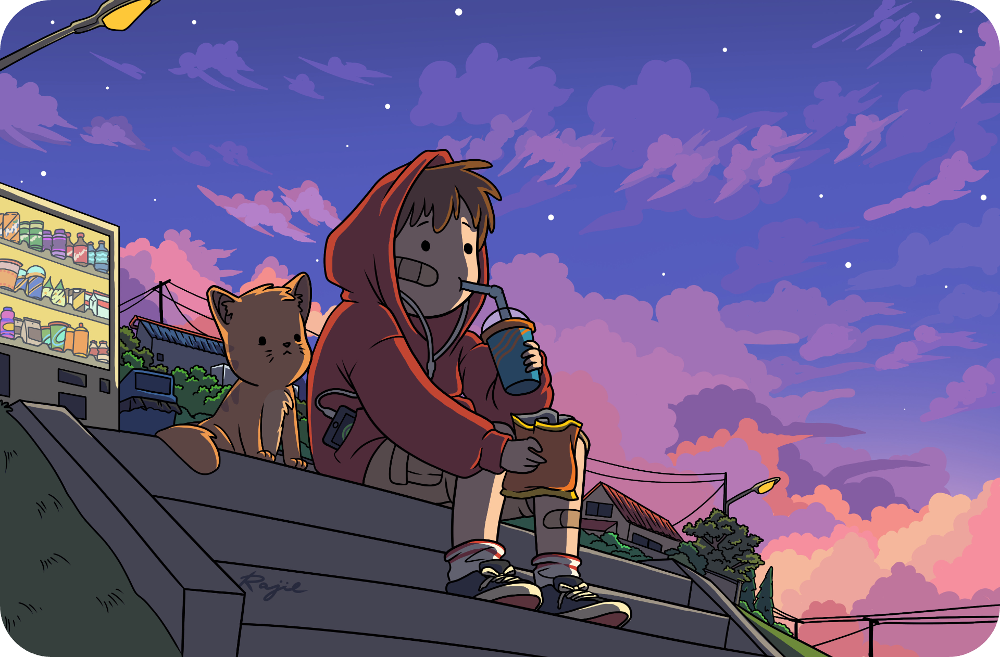

# 👾 PRESS START 👾

 

---

## 🎮 CHARACTER SELECT

| **STAT** | **VALUE** | **PROGRESS** |
| :--- | :--- | :--- |
| **Class** | `Golang Specialist` | `[==========]` MAX |
| **Mood** | `Slow Heat` | `[==........]` 20% |
| **Hobby** | `Money Maker` | `[======....]` 60% |
| **Hate** | `Exams` | `[==========]` 100% |

 

## 🎒 INVENTORY

<!-- Programming Languages -->

<!-- Tools & DevOps -->

---

## 📜 QUEST LOG (Stats)

 

## 👾 MINI GAME

<picture>
  <source media="(prefers-color-scheme: dark)" srcset="https://raw.githubusercontent.com/ThePeppy/ThePeppy/output/github-contribution-grid-snake-dark.svg">
  <source media="(prefers-color-scheme: light)" srcset="https://raw.githubusercontent.com/ThePeppy/ThePeppy/output/github-contribution-grid-snake.svg">
  
</picture>

---

### 🕹️ THANKS FOR VISITING! 🕹️

